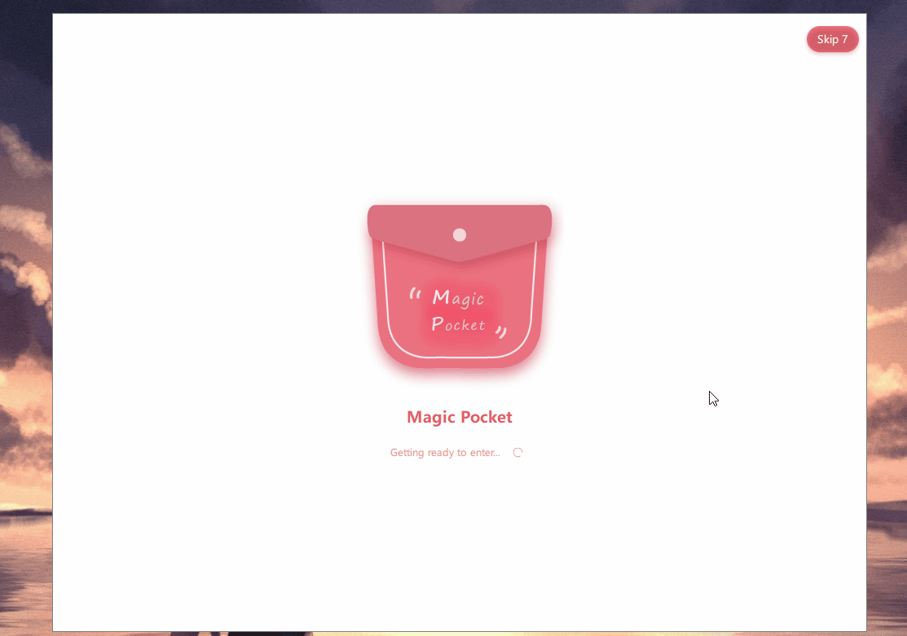

# A simple startup framework for QML/QtQuick program.

Support Qt6.5 and above, recommended version Qt6.8.

支持 Qt6.5 以上，但由于 Qt 的 bug，6.7版本无法正常使用，建议使用 6.8进行编译。

该项目是一种简单的 QML/QtQuick 程序加速启动框架。

其原理在于：通过将程序内进行组件化隔离，将应用程序分为：Preload 组件、Entity 组件以及 Interface 组件，并通过预加载的形式，首先将 Preload 组件通过 QML JS Engine 加载成窗口，以达到程序在软件级的最大启动速度。同时将 Entity 组件的内容进行模块化分层，形成并行或串行的链式模块加载。当 Entity 组件的所有模块加载完成，Preload组件可自动或手动退出，程序最终启动完成。

组件化的设计方式通过插件的形式完成，因此主程序仅作为启动器的方式使用（类似于小程序，快应用等）。如果将主程序作为系统级服务，预加载Qt及本框架的依赖后，通过 fork 子进程来实现一种系统级 QML 程序启动器，在不使用类似 Prelink 技术的前提下，也能提供 QML 程序百分之70%的启动速度。

除了进行应用级别的程序启动外，Preload、 Entity 和 Interface 组件可以单独组成一个 App 进行嵌套加载，你可以立即为这套启动器不光可以将 App 启动为一个窗口，也可以将其作为窗口内一个单独的子组件进行加载，通过这套框架可以将 QML 实现类似应用容器或程序集的功能。

框架提供了丰富的转场属性并提供了 Preload 向 Entity 转场的动画接口，同时还提供了两种不同的特效直接使用：翻转特效和缩放特效，下面演示案例都使用翻转特效，

框架化项目的开发仓库为 [CCMagicPocket](https://github.com/cccccccb/CCMagicPocket)，该项目正在开发设计过程中，仅供参考。

## Preload 组件演示

Preload 组件需要提供其入口 QML 文件，参考如下：
```qml
// PreloadWindow.qml
import QtQuick
import QtQuick.Controls
import QtQuick.Controls.Material
import QtQuick.Effects

import CCStartup  // 导入模块

AppPreloadItem {  // 模块的根 Item 需要指定成 AppPreloadItem 其他则无效
    id: root

    // 如果当前作为容器的子组件进行加载，需要将 preloadSurface 设置为 Item 或者 Custom，由于 Window 
    // 是默认属性，这里则无需设置，同样也可设置为 ApplicationWindow，对应的 QML 窗口为 Window 和 ApplicationWindow。
    // preloadSurface: AppPreloadItem.WindowSurface
    loadingOverlay: PreloadOverlay {  // 该属性为 Preload （窗口或组件）显示时，需要显示的加载界面（默认覆盖全屏）
        id: overlay  // PreloadOverlay 是用户自定义实现的内容，用户可自由定义需要如何显示

        Button {
            id: skipButton
            anchors.right: parent.right
            anchors.top: parent.top
            anchors.topMargin: 10
            anchors.rightMargin: 10

            Material.background: Qt.color("#CCE04F5F")
            Material.foreground: Qt.color("#FFFFFFFF")
            Material.roundedScale: Material.ExtraLargeScale
            Material.elevation: 4

            visible: preloadCountdown.running
            text: qsTr("Skip") + " " + preloadCountdown.current

            onClicked: {
                preloadCountdown.running = false
            }
        }
    }

    autoExitOverlay: false  // 该属性表示：是否当 Entity 加载完成时，自动退出 Preaload
    overlayExitWhen: !preloadCountdown.running  // 该属性表示：Overlay 的自动退出时机，这里表示倒计时秒表结束
    transitionGroup:  FlickTransition {}  // 该属性表示：转场特效，FlickTransition 是模块提供的翻转特效
    initialProperties: InitialProperties {  // 该属性表示: 当 Preload（这里是窗口） 初始化时需要同步初始化的属性
        readonly property bool visible: true
        readonly property int width: 1000  // 窗口宽度
        readonly property int height: 760    窗口高度
        readonly property string title: "MagicPocket"  // 窗口标题
        readonly property color color: "transparent"  // 窗口是否透明
    }

    Countdown {
        id: preloadCountdown
        interval: 10
        running: root.visible
    }
}
```
```qml
// PreloadOverlay.qml
import QtQuick
import QtQuick.Controls
import QtQuick.Controls.Material

Rectangle {
    color: "white"
    border.color: "gray"
    border.width: 1
    radius: 8

    Column {
        anchors.centerIn: parent
        spacing: 20
        populate: Transition {
            ParallelAnimation {
                NumberAnimation {
                    properties: "y"
                    duration: 400
                    from: to - 40
                    easing.type: Easing.OutBounce
                }

                NumberAnimation {
                    properties: "opacity"
                    duration: 400
                    from: 0
                    to: 1
                }
            }
        }

        Image {
            source: "../res/icon.png"
            anchors.horizontalCenter: parent.horizontalCenter
        }

        Text {
            anchors.horizontalCenter: parent.horizontalCenter
            horizontalAlignment: Text.AlignHCenter
            text: "Magic Pocket"
            color: Qt.color("#EEE04F5F")
            font.bold: true
            font.pointSize: 14
        }

        Row {
            anchors.horizontalCenter: parent.horizontalCenter
            spacing: 10

            Text {
                anchors.verticalCenter: parent.verticalCenter
                verticalAlignment: Text.AlignVCenter
                horizontalAlignment: Text.AlignHCenter
                text: qsTr("Getting ready to enter...")
                color: Qt.color("#A0E04F5F")
            }

            BusyIndicator {
                anchors.verticalCenter: parent.verticalCenter
                Material.accent: Qt.color("#A0E04F5F")
                running: true
                width: 24
                height: 24
            }
        }
    }
}
```

预览组件展开效果如下：


预览组件翻转效果如下：


## Entity 组件代码

Entity 组件作为应用程序主体承担程序核心功能，因此其代码复杂度和交互数量会显著提高。框架设计的本质是，能将其延后到窗口创建完毕，并通过并行加载的方式在应用程序后台加载，而前台显示类似 Android 或 IOS 程序启动时的开屏动画效果。让用户无感知的进入程序。
其入口代码演示如下：
```qm
import QtQuick
import QtQuick.Controls
import QtQuick.Layouts

import CCMagicPocket  // 用户的核心模块
import CCMagicPocket.impl  // 用户的核心模块

import CCStartup  // 导入框架

import "left"
import "title"
import "bottom"


AppStartupItem {  // 需要使用 AppStartupItem 作为其根 Item，以便框架可以控制其内部元素的加载。
    id: root
    asynchronous: true  // 表示异步加载或同步加载。异步加载时不会阻塞 UI 线程进行的动画，同步则可能在部分需要额外时间时界面出现卡顿现象，但异步加载的时间可能略低于同步加载

    AppStartupComponent {  // 作为需要加载的启动模块，需要AppStartupComponent作为其基类，否则框架无法控制其依赖关系，进而影响加载时间。
        id: mainPlaneComp

        MainDesktopPlane {  // 模块加载的核心内容，这里是背景层，用户可以自定义其内容进行加载。
            id: mainPlane
            anchors.fill: parent
            backgroundImagePath: Qt.url("../../res/default_wallpaper_2.jpg")
        }
    }

    AppStartupComponent {  // 同理需要加载的模块使用AppStartupComponent进行封装。
        id: layoutPlaneComponent
        depends: mainPlaneComp  // 该属性表示：当前模块需要依赖其他模块加载完成后再加载。框架会自动寻找依赖关系的最底层而线性加载，这里依赖的原因是此模块的核心内容依赖了 mainPlaneComp 创建的内容。

        LayoutPlane {
            anchors.fill: parent
            parent: AppStartupItem.mainPlane  // AppStartupComponent 内部由于上下文是隔离的（组件是动态创建的，创建前你无法获取其父类上下文）
                                              // 你无法直接同一层级下的其他 AppStartupComponent 核心内容，但框架提供了便捷方式，
                                              // 即 AppStartupItem 的附加属性，通过这种方式你可以在任意内容下获取其他内容的属性。
                                              // 前提是：你获取它之前，它必须已经创建完毕（确定好 depends），否则将会报错。

            Component.onCompleted: {
                AppStartupItem.mainPlane.layoutPlane = this  // 你也可以通过 AppStartupItem 的附加属性调试其他内容的值
            }
        }
    }

    AppStartupComponent {
        depends: layoutPlaneComponent

        WindowPane {
            anchors.fill: parent

            Component.onCompleted: {
                AppStartupItem.mainPlane.windowPlane = this
                AppStartupItem.mainPlane.currentPlane = this
            }
        }
    }

    AppStartupComponent {
        depends: layoutPlaneComponent

        FullscreenPlane {
            anchors.fill: parent

            Component.onCompleted: {
                AppStartupItem.mainPlane.fullscreenPlane = this
            }
        }
    }

    onPopulateChanged: {  // populate 属性表示从 Preload 状态切换到 Entity时，另外还有一个状态为 loaded 其表示 Entity 加载完成。
                          // 两者区别在于，用户可能在 Entity 加载完成后不立即切换，因此 populate 的时机会晚于 loaded
        if (populate) {
            Window.window.Frameless.enabled = true
            Window.window.Frameless.canWindowResize = true
        }
    }
}
```

## 模块结构

此模块处理作为独立的窗口存在之外，也可以通过程序内的子组件进行加载。区别在于，子组件的 Preload 入口需要指定成 ItemSurface 并且在程序的加载层指定其 Surface 的 Item，很容易理解：我们创建了一个组件，需要指定它不是一个窗口，且需要为它创建一个容器放置。

组件模块的项目在： [CCMagicPocket](https://github.com/cccccccb/CCMagicPocket) 部分预览如下：


## 后期优化

1. 性能优化：动画帧数、渲染性能、内外阴影、组件外模糊
2. Interface 组件用作容器/启动器的抽象层（服务）
3. 网络加载（Preload 和 Entity 通过网络 URL 进行动态加载）
